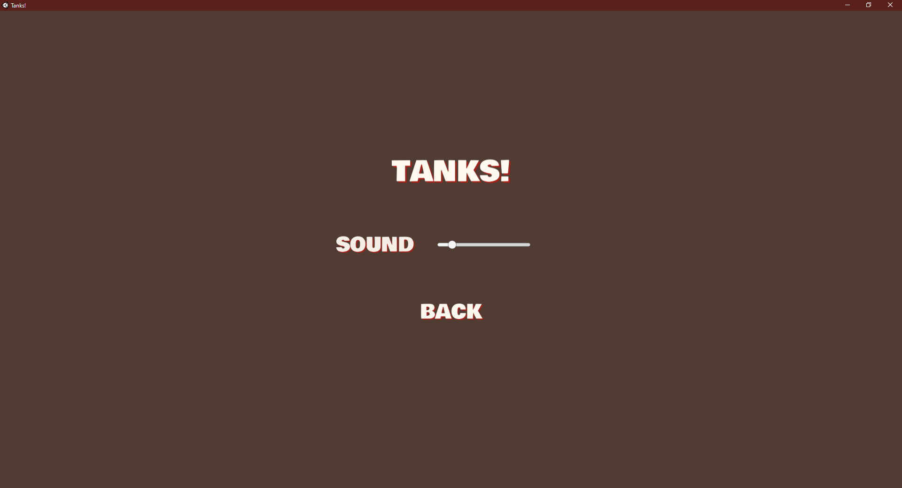
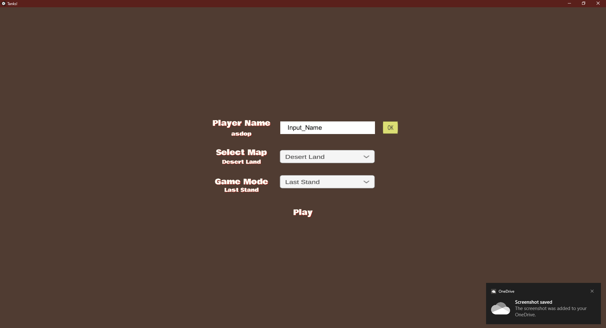
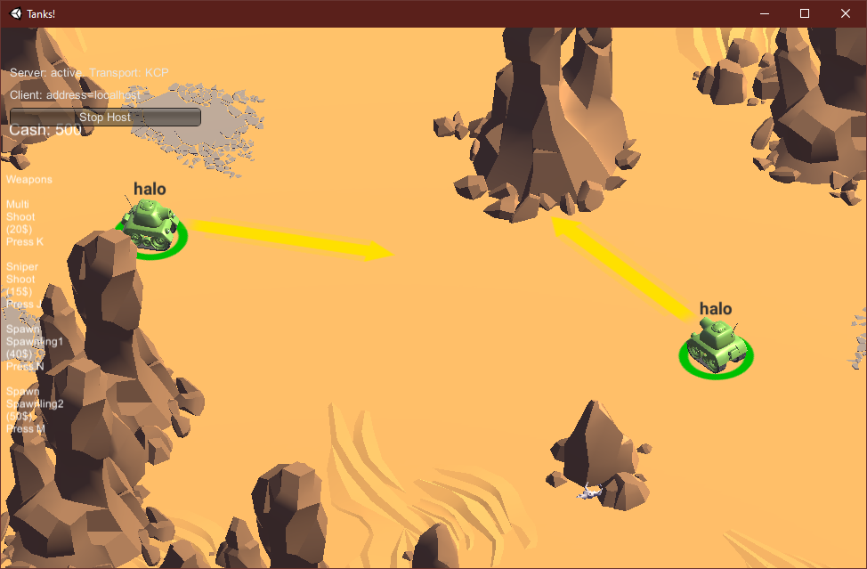

# Tanks: Extended

## Description
----------------
Game Tanks: Extended ini adalah pengembangan dari Tutorial Game Tanks yang dikembangkan dengan Unity. Game ini memiliki Genre Shooting 3D dan dapat dimainkan oleh beberapa pihak bersamaan melalui koneksi LAN. Game memiliki beberapa mode dan map yang dapat dipilih sesuai dengan keinginan.
## How To Run
### From Unity Editor
----------------
Ada dua cara, yang pertama

1. Tekan tombol play pada bagian atas layar
2. Unity Editor akan menjalankan game pada aplikasi tersebut

Cara kedua
1. Tekan menu `File`
2. tekan Pilihan `Build And Run`
3. Tunggu sampai program dibuat dan terbuka di folder berbeda
### Builded
----------------
1. Langsung jalankan/eksekusi saja executable file yang dimiliki

## How To Use
### Setting
----------------

1. Di main menu tekan button `Settings`.
2. Setting Audio yang diinginkan.
3. Jika sudah dapat menekan kembali tombol `Back`.

### Credits
----------------

1. Di main menu tekan button `Credits`.
2. Jika sudah dapat menekan kembali tombol `Back`.

### Start to Playing
----------------

1. Di main menu tekan button `Play`.
2. Akan dihadapkan pada page pengaturan permainan, pilih opsi yang diinginkan.
3. Jika sudah tekan tombol `Play`.
4. Akan dihadapkan pada multiplayer setup page, pilih yang diinginkan dengan menekan salah satu button.
5. Jika sudah, dan tidak ada masalah, permainan dapat segera dimulai.
## How To Play
----------------

1. Gunakan key WASD menggerakkan tank 
2. Gunakan key spasi untuk menembak peluru biasa
3. Gunakan key j atau k untuk menembak peluru khusus (membayar cash tertentu)
4. Gunakan key n atau m untuk mengeluarkan (spawn) bot untuk membantumu (membayar cash tertentu)
5. Di sekitar map akan terdapat spawnable crate, ambil untuk mendapatkan cash!
6. Lakukan tujuan permainan sesuai mode game, 
   - Mode Last Stand (atau Battle Royale) kalah kan musuh-musuhmu yang lain!
   - Mode Collect Money kumpulkan uang hingga sejumlah yang dimint adan jadilah pemenang!

## Specification Progress
----------------
1. **[Parsial, beberapa masih kurang sinkron antara server dan klien]** Multiplayer dapat dijalankan secara local area network dengan lebih dari dua pemain. Implementasi matchmaking (lobby) dibebaskan.
2. **[Selesai]** Pada main menu, terdapat settings untuk mengatur intensitas suara dan nama pemain yang diimplementasi dengan PlayerPrefs.
3. **[Selesai]** Desain pada map harus berbeda dari desain semula pada tutorial namun dapat menggunakan aset apapun.
4. **[Selesai]** Terdapat objek cash yang muncul secara periodik. Tank dapat mengambil cash untuk menambahkan uang yang dimilikinya.
5. **[Selesai]** Terdapat minimal dua jenis senjata dengan karakteristik yang berbeda. Pemain dapat membeli senjata dengan menggunakan cash.
6. **[Parsial, kurang animasi]** Terdapat minimal dua jenis karakter bergerak yang dapat dikeluarkan (tempat dibebaskan) dengan membayar cash, memiliki behavior yang berbeda, dan dapat diserang dengan peluru. Animasi saat karakter bergerak melakukan aksi (contohnya jalan, tembak, dan diam) harus berbeda, namun dapat menggunakan aset apapun.
7. **[Selesai]** Terdapat interaksi collision antara objek bergerak seperti tank dan karakter.
8. **[Selesai]** Aset tambahan yang digunakan dibebaskan namun perlu dituliskan pada credits.
9. **[Selesai]** Terdapat lebih dari satu map yang dapat dipilih oleh pemain.
10. **[Selesai]** Terdapat lebih dari satu game mode selain battle royale.
## Library and Asset Used
----------------
Berikut ini adalah Library dan Asset yang digunakan di luar dari Library Default System dari C# dan UnityEngine dari UI 

1. [Mirror](https://assetstore.unity.com/packages/tools/network/mirror-129321): Digunakan sebagai sarana untuk men-support pembuatan mutiplayer game.
2. [Tools Wooden Box](https://assetstore.unity.com/packages/3d/props/tools/tools-wooden-boxes-185738): Digunakan sebagai Asset (hanya model 3D tanpa script) untuk membuat crate pada game yang merupakan spawn object dan dapat dicollect untuk mendapatkan cash.
## Some Screenshot
----------------

1. Main Menu

    

2. Settings

    

3. Credits

    

4. Game Options, from name type, map and mode selection, and multiplayer options

    

5. Game Setup

    

6. Initial Condition Game

    

7. Crates In map, which is spawned every some interval

8. Shooting

    

9.  Special Shooting, there are multi shoot and sniper shoot

10. Spawning bots/minions, there are two types of them

    

11. Winning Round

    

## Separation of Tasks
----------------

1. Naufal Prima Yoriko (13518146)
   - Weapon System
   - Crate Spawn
   - Game Mode
   - Credits Page
   - Integration of Game
   - Bugfixing
  
  
2. Bambang Haryo 
   - Multiplayer
   - NPC
   - Bugfixing

3. Muhammad Ziyad Rahmatullah
   - Main Menu
   - Setting Page + Sound System
   - New Map + Map selection
   - Player Name Configure
